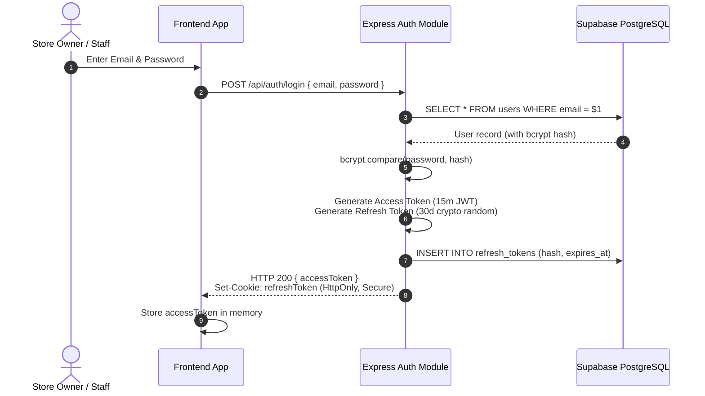
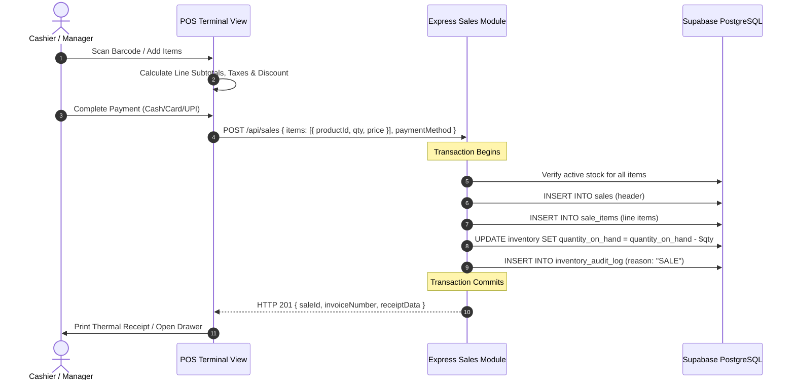
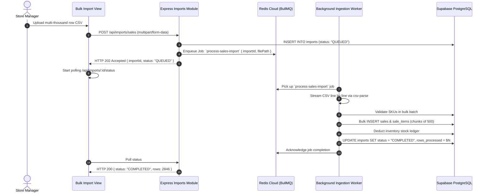
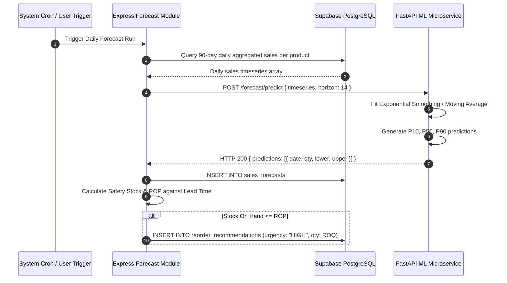

# StockPilot — Data Flow Architecture

This document maps out the end-to-end data lifecycle across critical user journeys: Authentication, POS Counter-Sale Checkout, Async Sales Ingestion, and ML Demand Forecasting.

---

## 1. Authentication & Session Lifecycle

---

## 2. In-Store POS Counter-Sale Checkout Flow

---

## 3. High-Throughput Async CSV Sales Import Flow

---

## 4. ML Demand Forecasting & Reorder Generation

