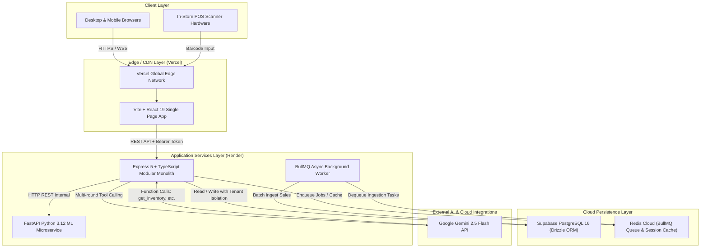

# StockPilot — System Architecture

This document describes the high-level system architecture, distributed component topology, and technology choices powering the StockPilot platform.

---

## 1. High-Level Architectural Diagram

---

## 2. Component Breakdown

### 2.1 Frontend Web (Vercel)
* **Stack:** React 19, TypeScript, Vite 8, Tailwind CSS, Recharts, Three.js / React Three Fiber.
* **Role:** Single Page Application (SPA) delivering a responsive dashboard, 3D interactive inventory visualizer, in-store POS register, and analytics workbench.
* **Routing:** Client-side routing powered by `react-router-dom` with deep-link fallback rewrites configured via `vercel.json`.

### 2.2 Backend API (Render)
* **Stack:** Node.js 22, Express 5, TypeScript, Drizzle ORM, Zod, Bcrypt, JsonWebToken.
* **Architecture Pattern:** **Modular Monolith**. Business logic is strictly compartmentalized into self-contained vertical feature modules (`modules/auth`, `modules/products`, `modules/inventory`, `modules/sales`, `modules/forecasting`, etc.).
* **Multi-Tenancy:** Hard tenant isolation on `store_id` enforced at the query level.

### 2.3 Machine Learning Microservice (Render)
* **Stack:** Python 3.12, FastAPI, Uvicorn, NumPy, Pandas, Scikit-learn, Statsmodels.
* **Role:** Dedicated computation engine for statistical time-series forecasting (Moving Averages, Exponential Smoothing) and demand anomaly detection.
* **Design:** Completely stateless. Accepts historical sales arrays via REST POST and returns projected sales with P10/P50/P90 confidence bounds.

### 2.4 Cloud Relational Database (Supabase)
* **Stack:** Managed PostgreSQL 16 with pgBouncer connection pooling.
* **ORM:** Drizzle ORM providing end-to-end TypeScript type safety, automated migrations, and zero-overhead SQL generation.
* **Catalog:** 25 tables covering stores, users, catalog, stock ledger, sales invoices, POs, and recommendations.

### 2.5 Cache & Queue (Redis Cloud)
* **Stack:** Managed Redis 7 cluster.
* **Role:**
  1. High-throughput job queue manager (BullMQ) for background CSV imports.
  2. Cache for expensive aggregate queries.
  3. Eviction policy configured to `noeviction` for reliable queue state retention.
