# StockPilot — Entity Relationship (ER) Diagram & Schema Data Model

This document contains the visual Entity Relationship Diagram (ERD) and relational mapping specifications for StockPilot's multi-tenant PostgreSQL database.

---

## 1. Visual Entity Relationship Diagram

```mermaid
erDiagram
    STORES ||--o{ USERS : "employs (1:N)"
    STORES ||--o{ CATEGORIES : "defines (1:N)"
    STORES ||--o{ SUPPLIERS : "contracts (1:N)"
    STORES ||--o{ PRODUCTS : "catalogs (1:N)"
    STORES ||--o{ INVENTORY : "tracks (1:N)"
    STORES ||--o{ INVENTORY_MOVEMENTS : "audits (1:N)"
    STORES ||--o{ SALES : "transacts (1:N)"
    STORES ||--o{ PURCHASE_ORDERS : "issues (1:N)"
    STORES ||--o{ REORDER_RECOMMENDATIONS : "generates (1:N)"
    STORES ||--o{ ANOMALIES : "flags (1:N)"
    STORES ||--o{ DEAD_STOCK_ITEMS : "identifies (1:N)"
    STORES ||--o{ NOTIFICATIONS : "delivers (1:N)"
    STORES ||--o{ IMPORTS : "ingests (1:N)"
    STORES ||--o{ AUDIT_LOGS : "records (1:N)"

    USERS ||--o{ REFRESH_TOKENS : "authenticates (1:N)"
    CATEGORIES ||--o{ PRODUCTS : "classifies (1:N)"

    SUPPLIERS ||--o{ SUPPLIER_PRODUCTS : "links (1:N)"
    PRODUCTS ||--o{ SUPPLIER_PRODUCTS : "sourced_from (1:N)"

    PRODUCTS ||--o{ INVENTORY : "has_stock (1:1)"
    PRODUCTS ||--o{ INVENTORY_MOVEMENTS : "logs_change (1:N)"
    PRODUCTS ||--o{ SALE_ITEMS : "sold_in (1:N)"
    PRODUCTS ||--o{ PURCHASE_ORDER_ITEMS : "ordered_in (1:N)"
    PRODUCTS ||--o{ FORECASTS : "forecasted_in (1:N)"
    PRODUCTS ||--o{ REORDER_RECOMMENDATIONS : "recommended_for (1:N)"
    PRODUCTS ||--o{ DEAD_STOCK_ITEMS : "evaluated_as (1:N)"

    SALES ||--o{ SALE_ITEMS : "contains (1:N)"
    SALES ||--o{ RETURNS : "refunds (1:N)"
    RETURNS ||--o{ RETURN_ITEMS : "itemizes (1:N)"

    PURCHASE_ORDERS ||--o{ PURCHASE_ORDER_ITEMS : "contains (1:N)"
    IMPORTS ||--o{ IMPORT_ERRORS : "captures (1:N)"

    STORES {
        uuid id PK
        varchar name
        varchar timezone
        varchar currency
        timestamp created_at
        timestamp updated_at
    }

    USERS {
        uuid id PK
        uuid store_id FK
        varchar email UK
        varchar password_hash
        varchar role
        timestamp created_at
        timestamp updated_at
    }

    REFRESH_TOKENS {
        uuid id PK
        uuid user_id FK
        varchar token_hash
        timestamp expires_at
        boolean revoked
        timestamp created_at
    }

    CATEGORIES {
        uuid id PK
        uuid store_id FK
        varchar name
        timestamp created_at
        timestamp updated_at
    }

    PRODUCTS {
        uuid id PK
        uuid store_id FK
        varchar name
        varchar sku
        varchar barcode
        uuid category_id FK
        numeric cost_price
        numeric selling_price
        boolean is_active
        timestamp created_at
        timestamp updated_at
    }

    SUPPLIERS {
        uuid id PK
        uuid store_id FK
        varchar name
        varchar contact_name
        varchar email
        varchar phone
        integer lead_time_days
        timestamp created_at
        timestamp updated_at
    }

    SUPPLIER_PRODUCTS {
        uuid id PK
        uuid supplier_id FK
        uuid product_id FK
        numeric supplier_price
        integer min_order_quantity
        integer lead_time_days
        timestamp created_at
    }

    INVENTORY {
        uuid id PK
        uuid store_id FK
        uuid product_id FK,UK
        integer current_stock
        integer min_stock
        integer max_stock
        integer reorder_point
        integer safety_stock
        timestamp updated_at
    }

    INVENTORY_MOVEMENTS {
        uuid id PK
        uuid store_id FK
        uuid product_id FK
        integer quantity_change
        varchar reason
        uuid reference_id
        timestamp created_at
    }

    SALES {
        uuid id PK
        uuid store_id FK
        varchar receipt_number UK
        numeric total_amount
        numeric tax_amount
        numeric discount_amount
        varchar payment_method
        varchar status
        timestamp created_at
    }

    SALE_ITEMS {
        uuid id PK
        uuid sale_id FK
        uuid product_id FK
        integer quantity
        numeric unit_price
        numeric total_price
    }

    PURCHASE_ORDERS {
        uuid id PK
        uuid store_id FK
        uuid supplier_id FK
        varchar po_number UK
        varchar status
        numeric total_amount
        timestamp expected_date
        timestamp created_at
        timestamp updated_at
    }

    PURCHASE_ORDER_ITEMS {
        uuid id PK
        uuid purchase_order_id FK
        uuid product_id FK
        integer quantity_ordered
        integer quantity_received
        numeric unit_cost
    }

    FORECASTS {
        uuid id PK
        uuid store_id FK
        uuid product_id FK
        varchar model_type
        numeric predicted_quantity
        numeric confidence_lower
        numeric confidence_upper
        date forecast_date
        timestamp created_at
    }

    REORDER_RECOMMENDATIONS {
        uuid id PK
        uuid store_id FK
        uuid product_id FK
        integer recommended_quantity
        varchar reason_code
        varchar urgency
        boolean is_actioned
        timestamp created_at
    }
```

---

## 2. Cardinalities and Relationships

| Parent Table | Child Table | Cardinality | Foreign Key Constraint | Cascading Behavior |
| :--- | :--- | :--- | :--- | :--- |
| `stores` | `users` | 1 : N | `users.store_id → stores.id` | `ON DELETE CASCADE` |
| `stores` | `products` | 1 : N | `products.store_id → stores.id` | `ON DELETE CASCADE` |
| `stores` | `categories` | 1 : N | `categories.store_id → stores.id` | `ON DELETE CASCADE` |
| `stores` | `suppliers` | 1 : N | `suppliers.store_id → stores.id` | `ON DELETE CASCADE` |
| `stores` | `inventory` | 1 : N | `inventory.store_id → stores.id` | `ON DELETE CASCADE` |
| `stores` | `sales` | 1 : N | `sales.store_id → stores.id` | `ON DELETE CASCADE` |
| `stores` | `purchase_orders`| 1 : N | `purchase_orders.store_id → stores.id` | `ON DELETE CASCADE` |
| `users` | `refresh_tokens`| 1 : N | `refresh_tokens.user_id → users.id` | `ON DELETE CASCADE` |
| `categories` | `products` | 1 : N | `products.category_id → categories.id` | `ON DELETE SET NULL` |
| `products` | `inventory` | 1 : 1 | `inventory.product_id → products.id` | `ON DELETE CASCADE` |
| `sales` | `sale_items` | 1 : N | `sale_items.sale_id → sales.id` | `ON DELETE CASCADE` |
| `products` | `sale_items` | 1 : N | `sale_items.product_id → products.id` | `ON DELETE RESTRICT` |
| `purchase_orders` | `purchase_order_items` | 1 : N | `purchase_order_items.purchase_order_id → purchase_orders.id` | `ON DELETE CASCADE` |
| `suppliers` | `supplier_products` | 1 : N | `supplier_products.supplier_id → suppliers.id` | `ON DELETE CASCADE` |
| `products` | `supplier_products` | 1 : N | `supplier_products.product_id → products.id` | `ON DELETE CASCADE` |

---

## 3. Indexing & Multi-Tenant Performance Optimization

To enforce sub-10ms response times and prevent sequential table scans:
* **Composite SKU Index:** `UNIQUE INDEX ON products (store_id, sku)` guarantees uniqueness per store while allowing different tenants to stock the same manufacturer SKU.
* **Store Activity Index:** Composite B-tree index `ON sales (store_id, created_at DESC)` ensures instant range queries for sales reports and analytics.
* **Inventory Unique Mapping:** `UNIQUE INDEX ON inventory (store_id, product_id)` guarantees each SKU has exactly one authoritative inventory ledger entry per store.
* **Audit Trail Indexing:** `ON audit_logs (store_id, created_at DESC)` powers the activity history log with constant-time indexing.
