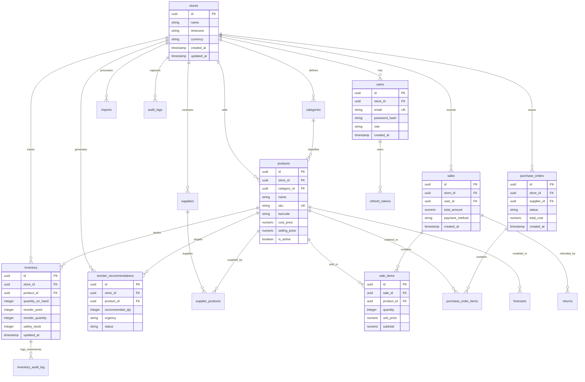

# StockPilot — Database Schema & Migrations

This document details the PostgreSQL schema, multi-tenant data architecture, and Drizzle ORM migration workflow for StockPilot.

---

## 1. Multi-Tenant Architecture & Data Isolation

StockPilot uses a **Shared Database, Shared Schema with Tenant Discriminator** design.
* Every business entity table (products, inventory, sales, suppliers, purchase orders, forecasts) contains a `store_id: uuid` foreign key column referencing `stores(id)`.
* Every SQL query initiated by a user request enforces `WHERE store_id = req.auth.storeId` derived from the cryptographically verified JWT session.
* All cascading foreign keys guarantee that if a tenant store is deleted, all associated tenant data is cleaned up atomically.

---

## 2. Entity Relationship Diagram (ERD)



---

## 2. Table Catalog (25 Tables)

### 2.1 Core & Multi-Tenancy
* **`stores`**: Multi-tenant organizations. Holds `id`, `name`, `currency`, `timezone`, `created_at`.
* **`users`**: Tenant user accounts. Holds `id`, `store_id`, `email`, `password_hash`, `role` (`owner`, `manager`, `staff`).
* **`refresh_tokens`**: Rotating session tokens. Holds `id`, `user_id`, `token_hash`, `expires_at`, `revoked`.
* **`audit_logs`**: System audit trail. Holds `id`, `store_id`, `user_id`, `action`, `entity_type`, `entity_id`, `metadata`.

### 2.2 Inventory & Catalog
* **`categories`**: Product taxonomy per store.
* **`products`**: Product catalog (`sku`, `barcode`, `cost_price`, `selling_price`, `is_active`).
* **`suppliers`**: Vendor registry with contact details and reliability notes.
* **`supplier_products`**: Product-to-supplier mappings with lead times and minimum order quantities (MOQ).
* **`inventory`**: Store stock records per product (`quantity_on_hand`, `reorder_point`, `reorder_quantity`).
* **`inventory_audit_log`**: Stock ledger tracking every increment/decrement with reason codes.

### 2.3 Operations & Commerce
* **`imports`**: Tracking bulk CSV catalog/sales uploads.
* **`sales`**: Sales order headers (`total_amount`, `payment_method`, `timestamp`).
* **`sale_items`**: Line items per sale (`product_id`, `quantity`, `unit_price`, `subtotal`).
* **`purchase_orders`**: PO headers (`supplier_id`, `status`: draft, ordered, received).
* **`purchase_order_items`**: Line items for stock replenishments.
* **`returns`**: Customer return records linked to sales orders.

### 2.4 Intelligence & Machine Learning
* **`forecast_runs`**: Execution log of batch forecasting tasks.
* **`forecasts` / `sales_forecasts`**: Daily predicted demand quantities with confidence intervals.
* **`forecast_metrics`**: Model accuracy metrics (MAPE, RMSE, MAE).
* **`reorder_recommendations`**: AI-driven reorder proposals (`recommended_qty`, `reason`, `urgency`).
* **`dead_stock_reports`**: Stagnant inventory classifications and capital at risk.
* **`stockout_events` & `stockout_alerts`**: Detected and projected stockout instances.
* **`anomaly_events`**: Sales surges, dips, and inventory discrepancy detections.

---

## 3. Migration Workflow

Migrations are managed with **Drizzle Kit** (`apps/backend/drizzle.config.ts`):
* Migrations are stored in: `apps/backend/src/db/migrations/`.
* Running migrations:
  ```powershell
  cd apps/backend
  npx drizzle-kit migrate
  ```
* Schema source of truth: `apps/backend/src/db/schema.ts`.
